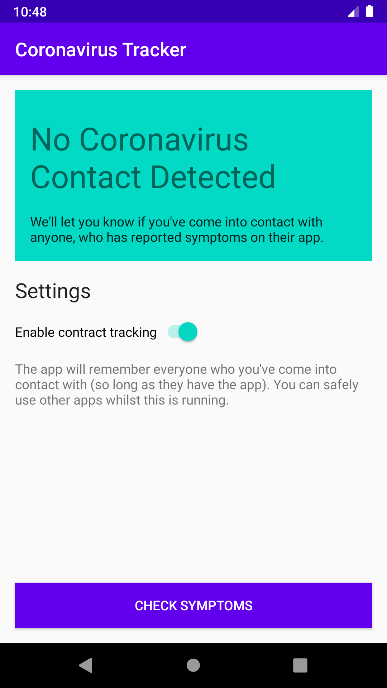
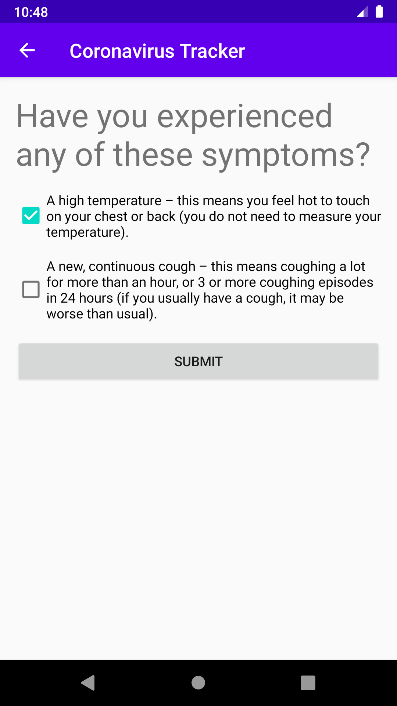
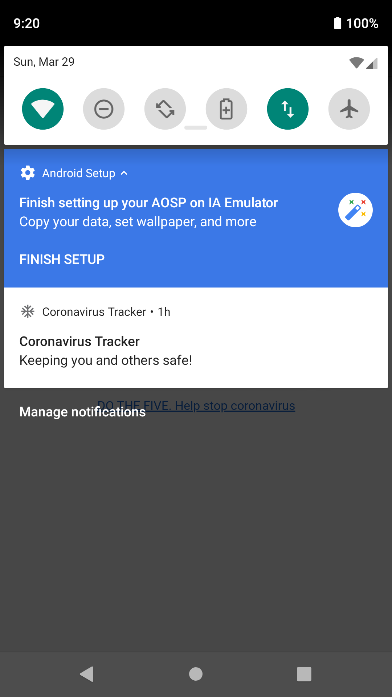

# Coronavirus Tracker

## Automated contact tracing, at scales no longer possible with human detective work

Coronavirus Tracker is a prototype contact tracing app that allows users to report symptoms. It then traces anyone who they have come into contact with over the past 5 days, and alerts these people to self-quarantine. The code is released under a MIT license and may be freely used.

## How it Works

### Logging all contact

Proximity to other people, who also have the app, is recorded based on three factors:
- Bluetooth signal strength
- Wifi hotspots that both phones can see (cross-triangulation)
- Near-ultrasound audio

When another device is within around 2m of range, the app will simply log how long contact has been maintained for.
